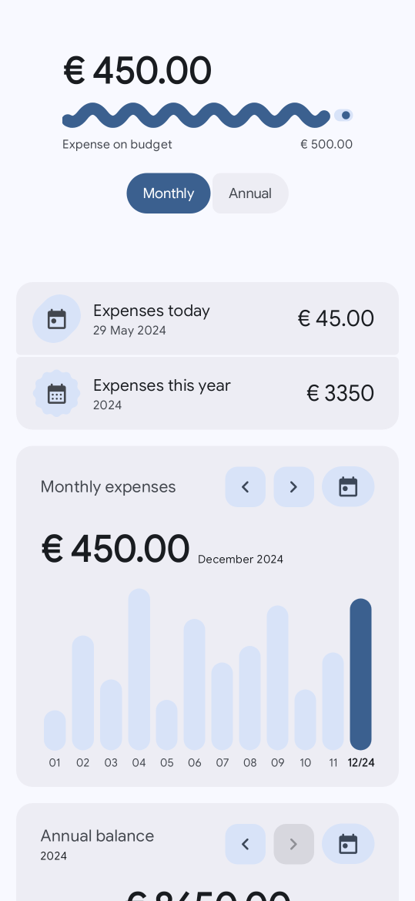
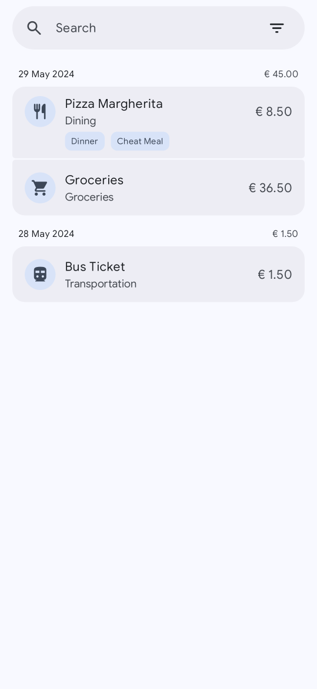
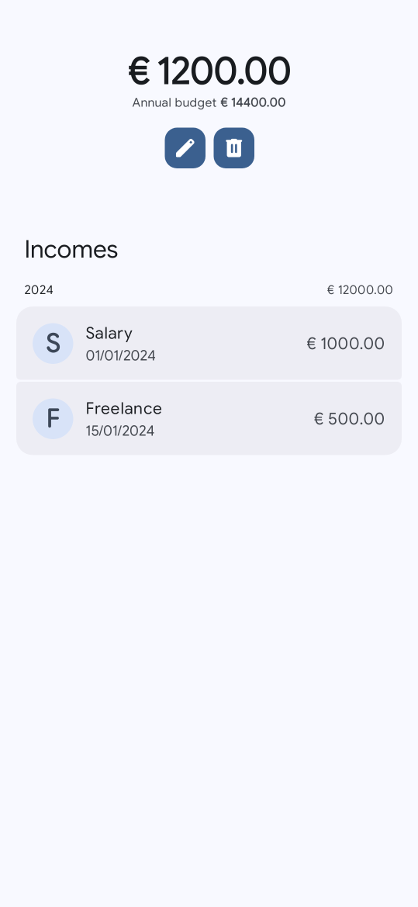
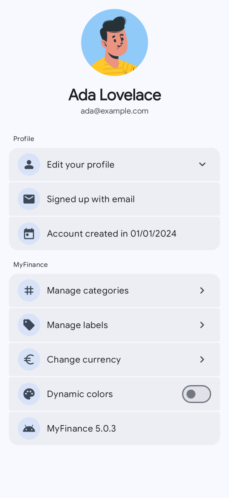

# MyFinance

**MyFinance is an Android app for keeping track of your personal finances.** You write down what
you spend and what you earn, and the app turns it into a clear picture: how much you spent today,
this month and this year, where the money goes, and whether you are staying within your budget.

It is meant to be quick to use every day — adding an expense takes a few seconds — and pleasant to
look at when you want to understand your habits.

| Dashboard | Expenses | Budget | Profile |
|:---:|:---:|:---:|:---:|
|  |  |  |  |

## What you can do

### See your finances at a glance — Dashboard
The first screen sums everything up:
- **Budget progress** — how much of your monthly (or annual) budget you have already spent.
- **Today and this year** — what you spent today, this month and so far this year.
- **Monthly expenses** — a bar chart of the last months, with your budget drawn as a line so you
  can spot the months you went over. Tap a bar to see that month's total.
- **Expenses by category** — a ring chart showing where your money went in a month or a year;
  tap a slice to see how much each category takes.
- **Annual balance** — income against expenses for the year, and what is left.

The chart cards let you move back and forth in time and jump back to today; the budget card switches
between the month and the year.

### Keep a list of your expenses — Expenses
All your expenses, newest first and grouped by day, with the total for each day. From here you can:
- **Search** by name.
- **Filter** by category, by label or by date range — and see the total of what the filters leave.
- **Long-press** an expense to edit it, duplicate it, change its labels or delete it (with an
  *Undo*, in case you change your mind).
- **Tap its icon** to move it to another category.

### Add an expense or an income
The big **+** button opens a short form: a name, an amount, a date, a category and, if you like, a
few labels. Switch between *Expense* and *Income* at the top. You can also start from your home
screen: long-press the app icon and choose **New expense** or **New income**.

### Plan with a budget — Budget
Set a **monthly budget** (the annual one is worked out for you) and keep a list of your
**incomes**, such as salary or refunds. The budget is what the Dashboard measures your spending
against.

### Organise with categories and labels
- **Categories** describe *what kind* of expense it is. There are nine — Housing, Groceries,
  Personal care, Entertainment, Education, Dining, Health, Transportation and Miscellaneous — and
  the app explains what belongs in each one.
- **Labels** are your own tags, like *Holiday*, *Dinner* or *Work*, to group expenses across
  categories. Create, rename and delete them whenever you want; deleting a label never deletes the
  expenses that used it.

### Make it yours — Profile
- Change your **name** and pick a **profile picture** (one of seven avatars, or your Google photo).
- Choose your **currency** from the common ones or the full list.
- Turn on **dynamic colours** to match your wallpaper (Android 12 and later).
- **Change your password** — or set one, if you signed up with Google.
- Log out, and see when you created your account and which version of the app you have.

### Your account, on every phone
Sign in with **email and password** or with **Google**; if you forget your password, the app sends
you a reset link. Your data is kept on the phone for speed and synced with your account, so it is
there on every device you sign in on.

### And a few more things
- **Light and dark theme**, following your system setting.
- **Phones, foldables and tablets** — a bottom navigation bar on phones, a side rail on larger
  screens.
- **English and Italian**.
- **Accessible** — every button has a spoken description for TalkBack, and charts can be explored
  by screen readers too.
- Works on **Android 10** and later.

## For developers

The app is written in **Kotlin** with **Jetpack Compose** and **Material 3 Expressive**, and uses
Navigation 3, Hilt, Room, DataStore, Firebase (Authentication, Cloud Firestore, Crashlytics), the
Credential Manager for Google sign-in, Coil for images and a baseline profile for fast start-up.

**Build and run** — open the project in Android Studio and run the `app` configuration. The
repository's `app/google-services.json` points at the author's Firebase project; to use your own,
replace it with the file from your Firebase console.

**Tests and quality** — JVM tests (including screenshot and accessibility checks), device tests
(including tests against the Firebase emulators), Android Lint with custom rules, and continuous
integration with coverage on SonarCloud. How to run each of them is in
[docs/testing.md](docs/testing.md).

## History

MyFinance has grown through several versions:
1. The first [Java version](https://github.com/francescofiorella/MyFinance-Java).
2. A rewrite in Kotlin, following the Material Design guidelines and the MVVM pattern.
3. A redesign with Material You.
4. Categories, incomes and budget management, and more charts.

Today it is built with Jetpack Compose and Material 3 Expressive, adds labels and layouts for
larger screens, and is covered by an automated test suite.
